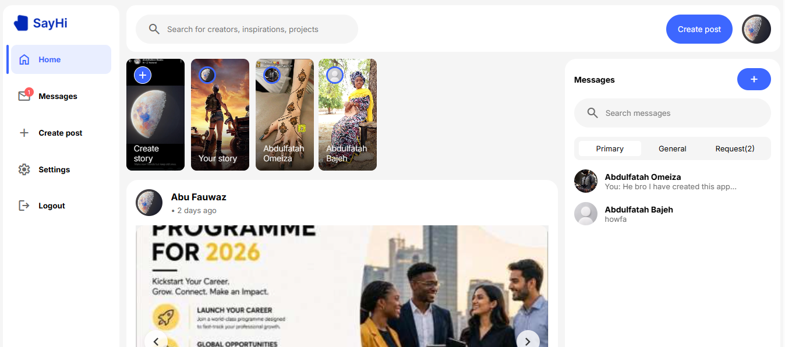
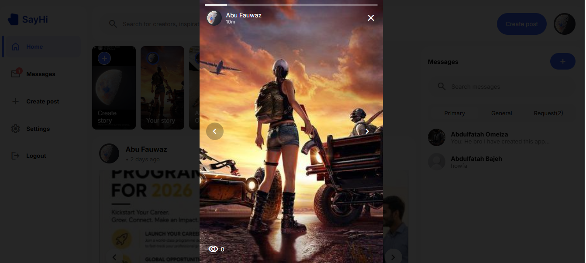
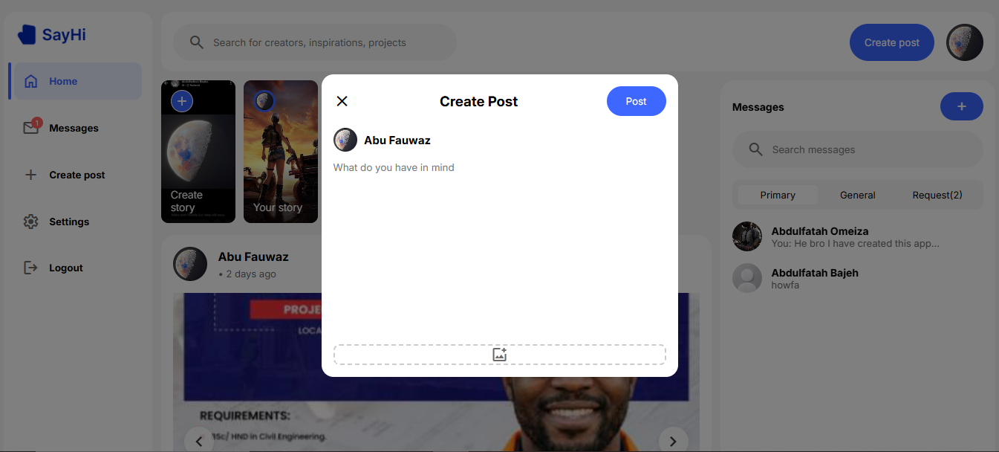
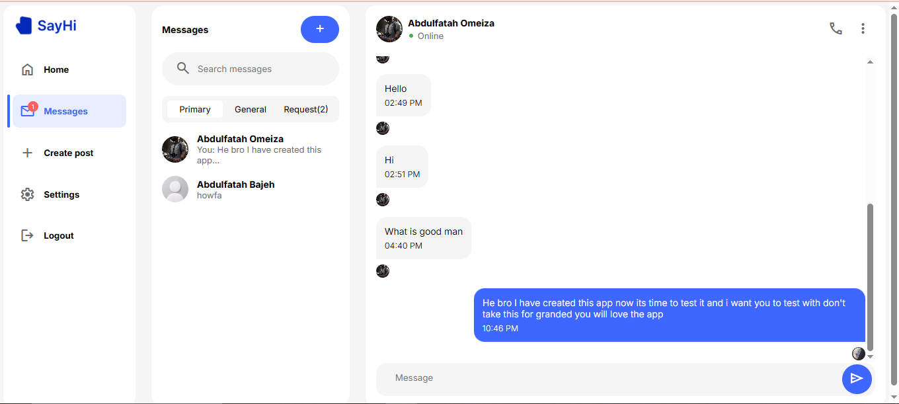
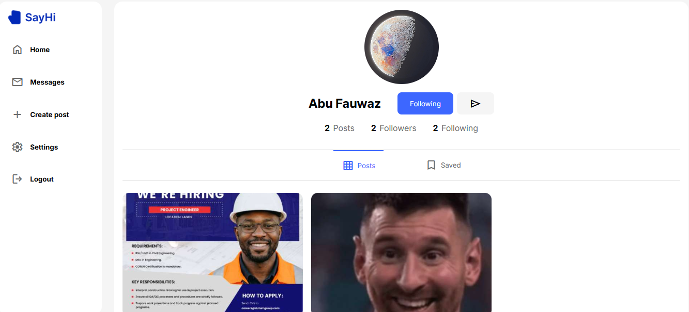

# Say Hi

Say Hi is a social media web application where users can connect, share posts and stories, and chat with other users.

## Features

* User registration and login
* Password reset
* Create and view posts
* Like and comment on posts
* Create and view stories
* User profiles
* User search
* Real-time messaging
* Responsive design
* Logout

## Screenshots

##  Technologies Used

* HTML
* CSS
* JavaScript
* Tailwind CSS
* Firebase Authentication
* Firestore
* Git & GitHub
* Netlify

## 📦 Installation

### 1. Clone the repository

### 2. COnfigure firebase

Create a Firebase project and enable:

Firebase Authentication
Email/Password Authentication
Cloud Firestore

Add your Firebase configuration to the project.

### 3. Deployment

The project is deployed using Netlify.

# What's Next?

* [] Better image storage
* [] Notifications
* [] More messaging features
* [] Video Calling
* [] Sending and Uploading Videos
* [] Performance improvements

## Author

### Abdulfatah Omeiza Bajeh
[Linkedin: Abdulfatah omeiza Bajeh](https://www.linkedin.com/in/abdulfatah-omeiza-bajeh/)